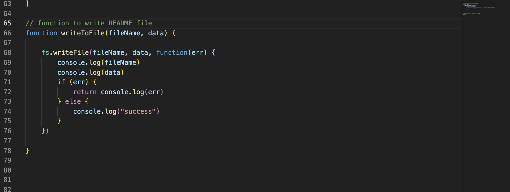
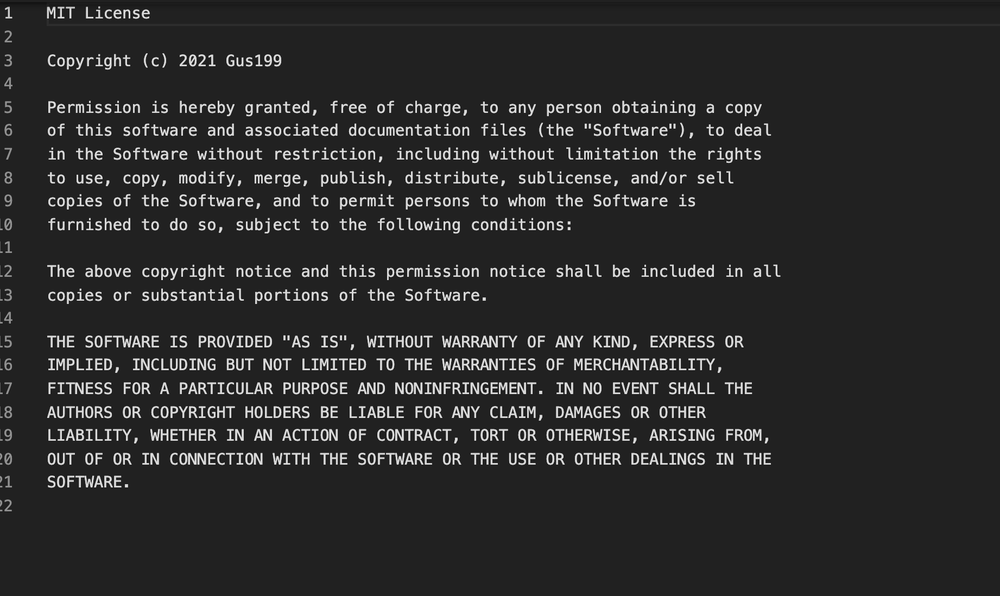
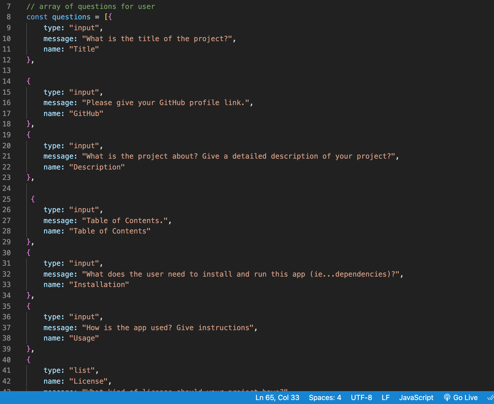

# README.md-Generator

# Description:

As A Developer

Back to Table of Contents
I want a command-line application that accepts user input.
I want to be prompted for information about my application repository.
I want a high-quality, professional README.md is generated with the title of my project and sections entitled Description, Table of Contents, Installation, Usage, License, Contribution Guidelines,  and Questions.
I want my project title to display as the title of the README.md-Generator.
I want a description, installation instructions, usage information, contribution guidelines, and test instructions; and then, this information is added to the sections of the README entitled Description, Installation, Usage, Contribution Guidelines, and Tests Instructions.
I want to choose a license for my application from a list of options; the section of the README entitled License that explains which license the application is covered under.

I want to enter my GitHub username; ant then this is added to the section of the README entitled Questions, with a link to my GitHub profile.
I want to enter my email address; and then this is added to the section of the README entitled Questions, with instructions on how to reach me with additional questions.

# Video Link :

* [Video Link](https://watch.screencastify.com/v/y2ngxQeGbBfX3GveIF5p)

# Screen Shots :
* 
* 
* 
* 

# Installation:
Download the template through GitHub.
Install dependency inquirer by typing into the command line 'npm i inquirer --save'

# Usage:
Once a user has opened the file:

Open the terminal
Type out 'node index.js'
Answer the prompts provided
Once all prompts have been answered then a README.md will be created with the user input in the corresponding sections of the README. A user can refer back to this template whenever working on a new project or assignment and requires a README.

# Contributing:

* not contributed yet
# Test :
* Not test yet
# Quetions :
feel free to email me for further questions at my Email : augustine2903a@gmail.com